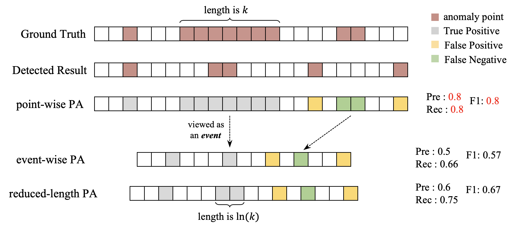

# Preliminaries

## Protocol types
In general, evaluation criteria can be roughly categorized into point-based protocols, range-based protocols and event-based protocols.

- Point-based protocols like traditional F1 treat each individual data point as a separate sample, disregarding the holistic characteristics of the anomaly segment. 
- Range-based protocols incorporate segment-level features, for instance, the detection latency, into the evaluation.
- Event-based protocols treat each anomaly segment as an individual event. Each event contributes to a true positive or false negative only once or limited times.

## Point-Adjustment strategy (PA)
Under this strategy, all timestamps within an anomalous segment are assigned the highest anomaly score present within that segment, thus the whole anomaly segment is considered to be detected if at least one anomaly score surpasses the threshold. Then the F1 score is obtained in a point-based manner. This is widely used in current methods, but is flawed when combined with point-based protocols. 

## Reduced-length PA (event-based protocols with mode log)
Partly Consider the length if anomaly segments against event-wise PA. Details are illustrated as follows:

## Delay
As depicted in the illustration, assuming the latency limit (k) is set to 3, an anomaly is considered effectively detected only if it is identified within three sampling points after its occurrence. We designate this strategy as **k-delay adjustment**. This measure enables a more precise assessment of whether the model can meet the requirement of the scenario where there is a high demand for real-time responsiveness. It is equally essential to acknowledge that this approach is applicable only to datasets whose anomalies are labeled without positional bias. We conduct experiments on the selected datasets with non-biased labels.

# All Built-in Protocols

::: Evaluations.Protocols
    options:
        show_submodules: true